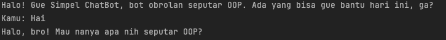
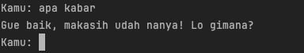
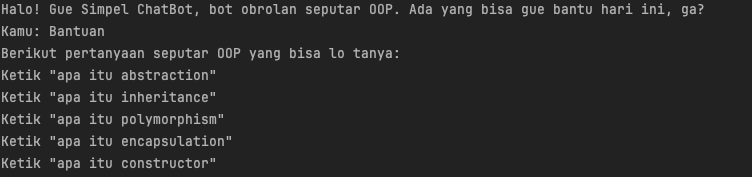
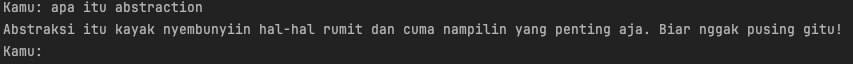
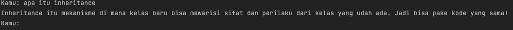
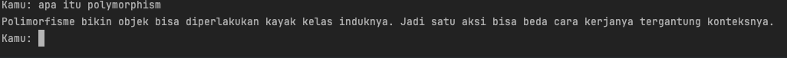
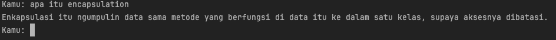
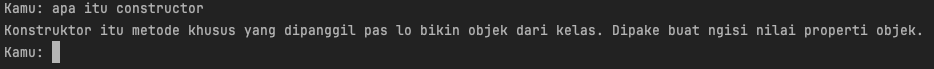
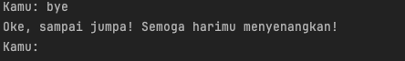

## Dokumentasi

### Deskripsi
Bot Obrolan Sederhana ini merupakan aplikasi yang dirancang untuk memberikan informasi mengenai konsep-konsep dalam Pemrograman Berorientasi Objek (OOP). Bot ini dapat memberikan jawaban berdasarkan pertanyaan yang diajukan oleh pengguna, serta memberikan daftar pertanyaan yang dapat ditanyakan.

----------- 

### Fitur
- Bot ini berisi informasi seputar OOP yang bisa ditanyakan.
- Beberapa pertanyaan yang bisa ditanyakan:
   1. Hai
   2. Apa kabar
   3. Baik
   4. Bye 
   5. Bantuan
   6. Apa itu abstraction
   7. Apa itu inheritance
   8. Apa itu polymorphism
   9. Apa itu encapsulation
   10. Apa itu constructor

---------

### Cara Menggunakan
1. **Mulai Obrolan:** 
   - Jalankan aplikasi Bot Obrolan.
   - Bot akan menyapa Anda dan menanyakan pertanyaan yang dapat Anda ajukan.

2. **Menanyakan Pertanyaan:**
   - Anda dapat bertanya dengan mengetikkan salah satu pertanyaan yang telah disediakan.
   - Contoh:
     - Jika Anda bertanya "Hai", maka akan dijawab:
       

     - Jika Anda bertanya "Apa kabar", maka akan dijawab:
       

     - Jika Anda bertanya "Baik", maka akan dijawab:
       

3. **Mendapatkan Bantuan:**
   - Jika Anda mengetik "Bantuan", bot akan memberikan daftar pertanyaan yang bisa Anda tanyakan.
   - Contoh tampilan bantuan:
     

4. **Mengetahui Konsep OOP:**
   - Untuk memahami lebih dalam tentang konsep OOP, Anda dapat bertanya mengenai:
     - **Apa itu Abstraction?**
       - Bot akan menjelaskan definisi dan fungsinya.
       

     - **Apa itu Inheritance?**
       - Bot akan memberikan penjelasan tentang pewarisan dalam OOP.
       

     - **Apa itu Polymorphism?**
       - Bot akan memberikan contoh dan definisi polimorfisme.
       

     - **Apa itu Encapsulation?**
       - Bot akan menjelaskan konsep enkapsulasi.
       

     - **Apa itu Constructor?**
       - Bot akan memberikan penjelasan mengenai konstruktor dalam kelas.
       

5. **Mengakhiri Obrolan:**
   - Ketik "Bye" untuk mengakhiri percakapan.
   - Bot akan membalas dengan ucapan selamat tinggal.
   

