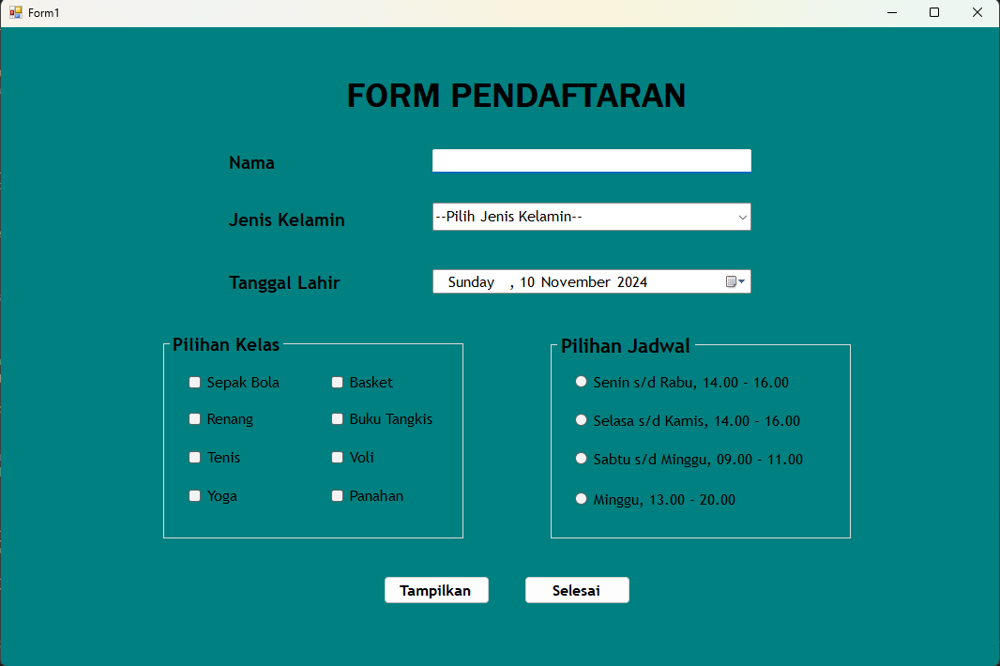
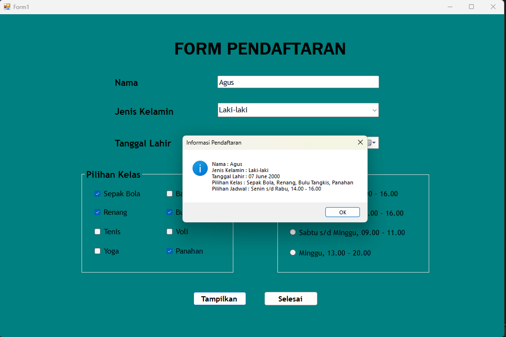
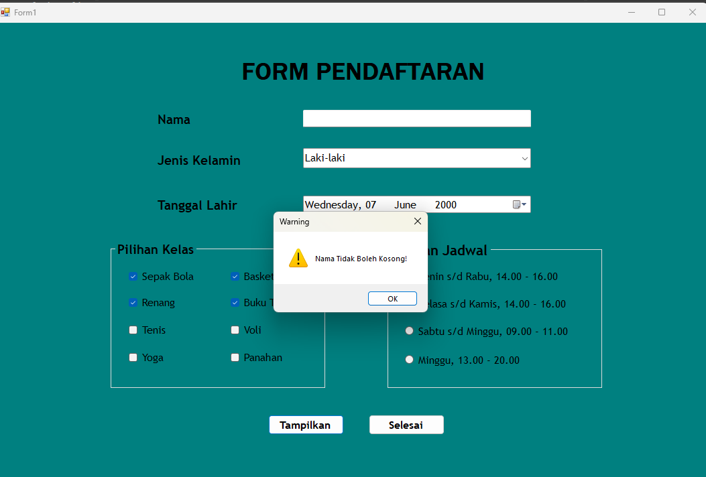
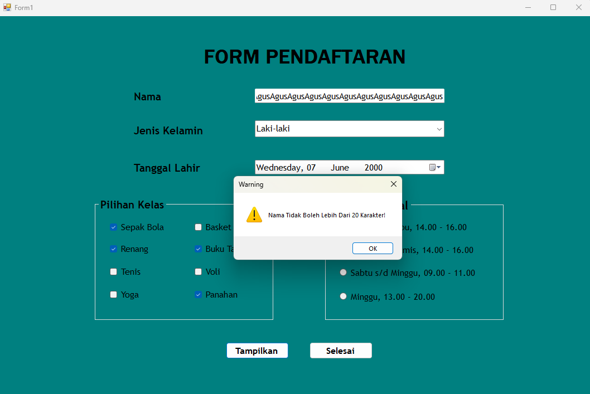
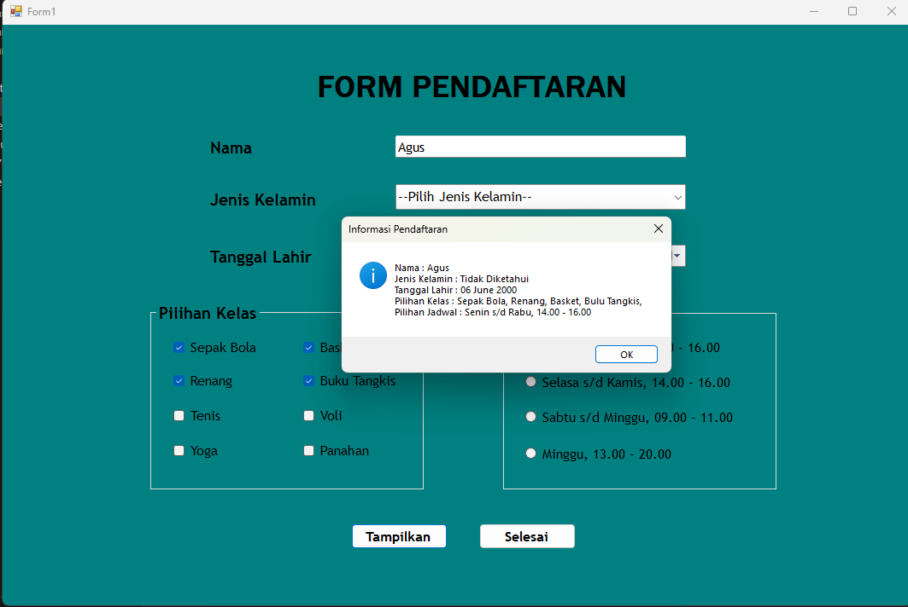
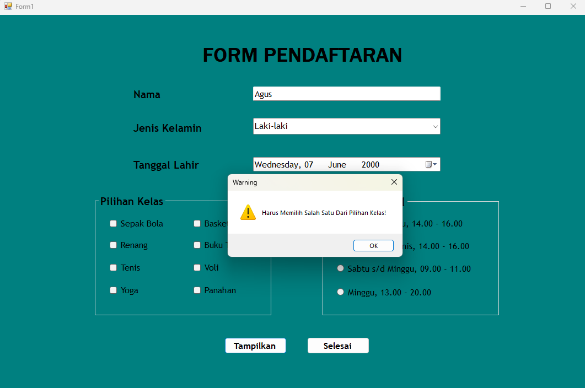
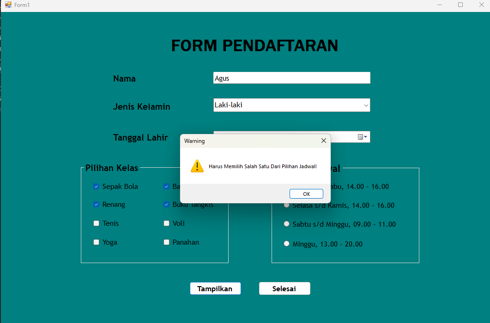

# Hasil Tugas Minggu Ke-5

---------

## Output Aplikasi

1. Halaman Utama
    - Tampilan awal aplikasi tempat pengguna bisa isi data
    - 

2. Data Form Lengkap
    - Semua kolom udah diisi sesuai aturan, jadi data bisa disimpan tanpa error.
    

3. Nama Tidak Diisi
    - Kolom "Nama" belum diisi.
    - 

4. Nama Lebih Dari 20 Karakter
    - Nama yang diisi terlalu panjang. Aplikasi minta pengguna kurangi jadi maksimal 20 karakter.
    - 

5. Jenis Kelamin Tidak Diisi
    - Kolom "Jenis Kelamin" kosong, aplikasi secara otomatis menngisi "Tidak diketahui".
    - 

6. Kelas Tidak Diisi
    - Kolom "Kelas" belum diisi, aplikasi minta untuk dilengkapi.
    - 

7. Jadwal Tidak Diisi
    - Kolom "Jadwal" kosong, aplikasi minta pengguna pilih jadwal dulu.
    - 